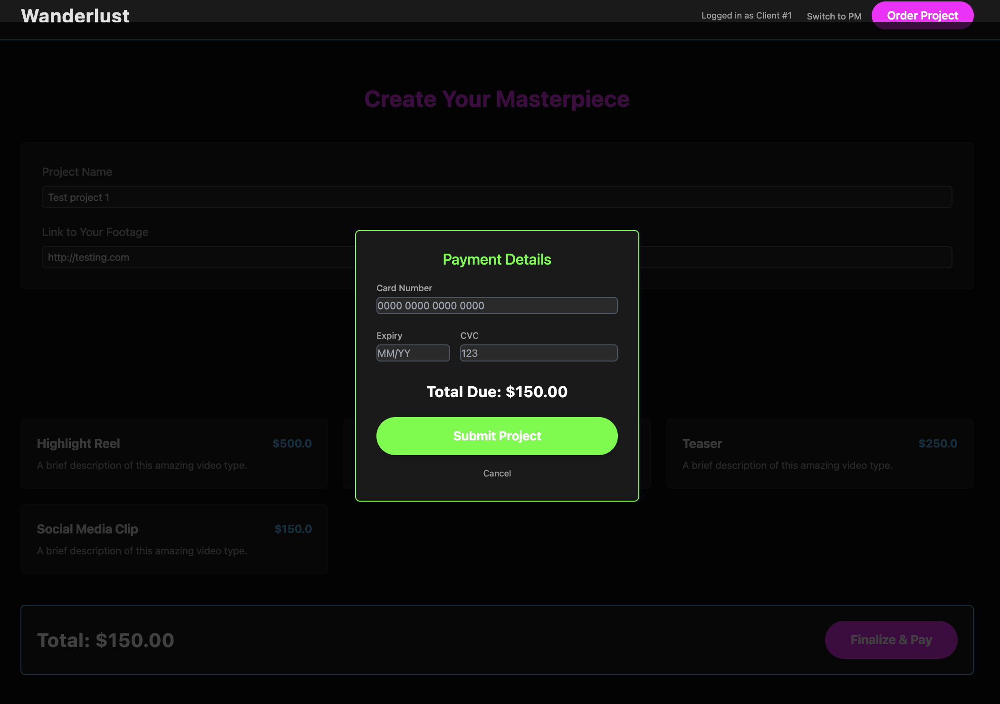

# Wanderlust Video Project Management App

## Overview
Wanderlust is a Rails 8.0 application for managing video projects between clients and project managers (PMs). It features project creation, notification system, role-based access, and a modern UI using Slim, Tailwind, and Hotwire (Turbo/Stimulus).

---

## Screenshots

### Projects


### UI/UX



### Functionality


---

## Features
- Client/PM role switching
- Project creation with video type selection and payment modal
- Notification system for PMs (with unread/read status)
- Filtering and pagination for projects and notifications
- Server-side and client-side validations
- RSpec test suite with model and request specs

## Setup

### Prerequisites
- Ruby 3.2.6
- Rails 8.0+
- MySQL
- Node.js & Yarn (for JS/CSS bundling)

### Install dependencies
```sh
bundle install
yarn install
```

### Database setup
```sh
rails db:reset # Drops, creates, migrates, and seeds the database
```

### Run the app
```sh
bin/dev
# or
rails server
```

### Run tests
```sh
bundle exec rspec
```

## Gems Used
- rails, mysql2, puma, pagy, slim-rails
- turbo-rails, stimulus-rails, jsbundling-rails, cssbundling-rails
- rspec-rails, shoulda-matchers, capybara, selenium-webdriver
- solid_cache, solid_queue, solid_cable
- kamal, thruster, bootsnap, brakeman, rubocop-rails-omakase

## Assumptions & Future Improvements
- **Default Users:** The app seeds with 1 default client and 1 default PM. A switch button is provided in development for demo/testing purposes. In a real production app, proper authentication, user management, and separation of roles would be required.
- **UI/UX:** If more time, would further polish the UI, add more feedback, and improve accessibility.
- **Validations:** Would add more advanced client-side validation (e.g., for payment modal) and custom error messages.
- **Notifications:** Could be refactored for more types, batch actions, and user preferences.
- **Jobs:** Notification jobs could be made asynchronous and more robust (e.g., retry logic, error handling).
- **API:** Would add API endpoints and serializers for mobile or third-party integration.
- **Authorization:** Could use Pundit or CanCanCan for more granular permissions.
- **Testing:** Would add more system/integration tests and edge case coverage.
- **File Uploads:** Could integrate ActiveStorage or a cloud provider for video uploads.
- **Production:** Add deployment instructions, environment variable management, and monitoring.

## Notes
- If you see a "No Clients Found" page, run `rails db:seed` to create initial data.
- The project status is managed internally and not user-editable at creation.
- For any questions or contributions, please open an issue or pull request.
